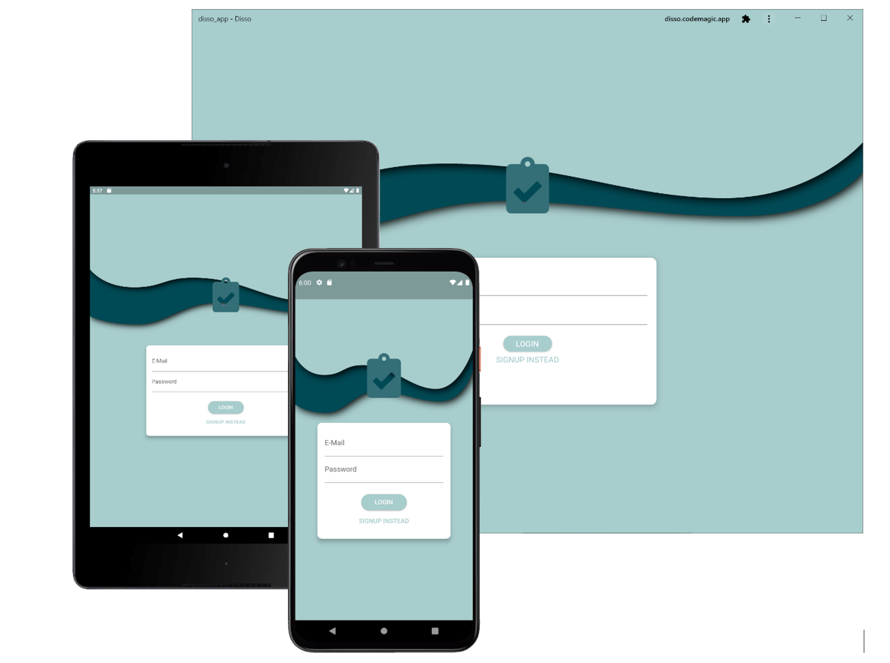
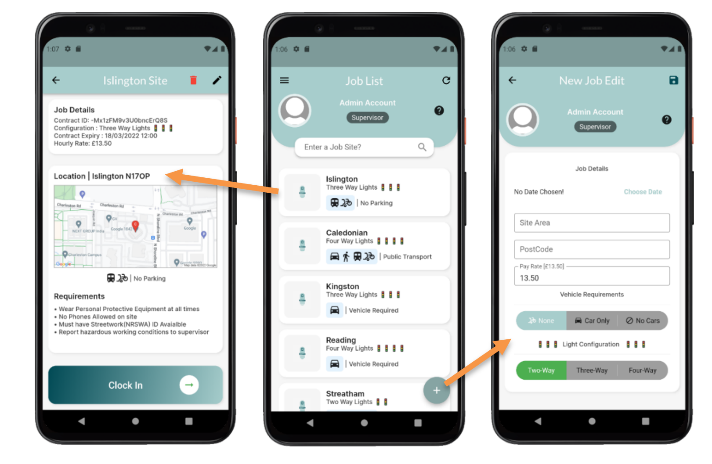

# Cross Platform Management Application

Visit [Disso Web Application](https://Dissoapp.link) 

Log into test account [optional]
| Field  | Credentials |
| ------------- | ------------- |
| Email  | admin@disso.com  |
| Password  | Admin1Password  |

## Installation (For Windows)

1) [Install the Futter SDK](https://docs.flutter.dev/get-started/install)
2) clone project
3) Navigate to lib/main.dart file using the Command Prompt
4) command to fetch dependencies: ```flutter pub get```
5) command to initialise app: ```flutter run```

## Abstract

The project aims to design and develop a cross platform job management application for agencies 
and mobile workers in the construction industry. The final developed system provides the following 
a comprehensive Job Management System:

-	Interactive Job Map
-	Modify Job Lists
-	Digital Shift Timesheet
-	Work history
-	Auto-generate invoice

The current application is available on mobile and desktop platforms. 
The main application is delivered by using a web application solution and there is also and .apk file that runs natively on Android Platforms.
The project was developed using Flutter cross platform framework and programmed using the Dart language by Google. 

The backend services and API use Firebase and Google Cloud Platform Services. 
A CI/CD pipeline with automated tests to deploy the system on AWS (Amazon Web Services), using serverless architecture.

## Preview




